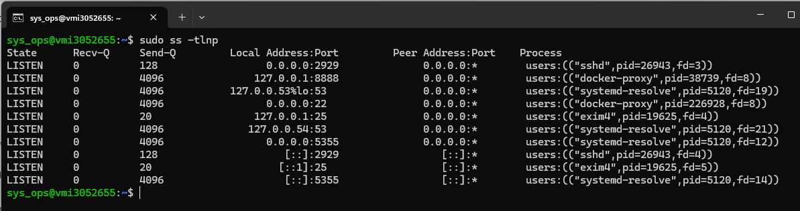
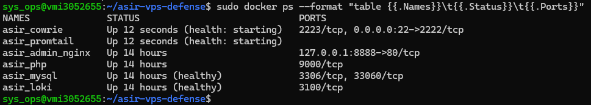
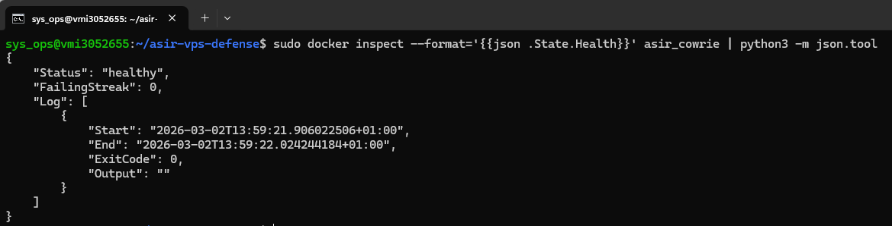
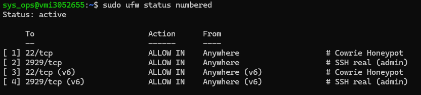
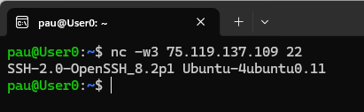

# 01 — Infraestructura y estado del sistema

Este bloque recoge el estado real del sistema en el momento de la validación, confirmando que todos los servicios se encontraban desplegados y operativos.

---

## EV-01 — `ev01_ss_puertos.png`

Se ejecutó `sudo ss -tlnp` en el host para verificar los bindings de red activos. La salida confirmó que el proceso `docker-proxy` ocupaba el puerto 22, correspondiente al contenedor Cowrie, y que el demonio `sshd` del sistema escuchaba en el puerto alternativo configurado durante el despliegue. El uso de `sudo` es necesario para que la columna `Process` muestre los nombres de los procesos propietarios de cada socket.

---

## EV-02 — `ev02_docker_ps.png`

Se ejecutó `docker ps` con formato extendido para obtener el estado de todos los contenedores. Los contenedores con healthcheck configurado (`asir_cowrie`, `asir_mysql`, `asir_loki`, `asir_promtail`) presentaban estado `Up (healthy)`, confirmando que los controles de salud definidos en el `docker-compose.yml` se superaban correctamente.

```bash
sudo docker ps --format "table {{.Names}}\t{{.Status}}\t{{.Ports}}"
```

---

## EV-03 — `ev03_docker_inspect_cowrie.png`

Se inspeccionó el estado de salud del contenedor Cowrie mediante `docker inspect`, extrayendo el bloque `State.Health`. Se verificó que el historial de healthchecks recientes presentaba `ExitCode: 0` en todas las ejecuciones, confirmando que el proceso interno de Cowrie escuchaba correctamente en el puerto 2222 del contenedor.

```bash
docker inspect --format='{{json .State.Health}}' asir_cowrie | python3 -m json.tool
```

---

## EV-04 — `ev04_ufw_status.png`

Se consultó el estado del firewall UFW con `ufw status numbered` para documentar las reglas activas. Se comprobó que únicamente los puertos necesarios para la operación del sistema estaban abiertos, y que el puerto 8888 del panel de administración no figuraba en las reglas de exposición pública.

---

## EV-05 — `ev05_banner_ssh_22.png`

Se conectó al puerto 22 del servidor mediante `nc` para obtener el banner SSH raw. La cadena devuelta correspondía al banner configurado en `cowrie.cfg` (`SSH-2.0-OpenSSH_8.2p1 Ubuntu-4ubuntu0.11`), distinto al del SSH real del host, confirmando que cualquier conexión entrante al puerto estándar era atendida por el honeypot y no por el servicio de administración.

```bash
nc -w3 <IP_VPS> 22
```

