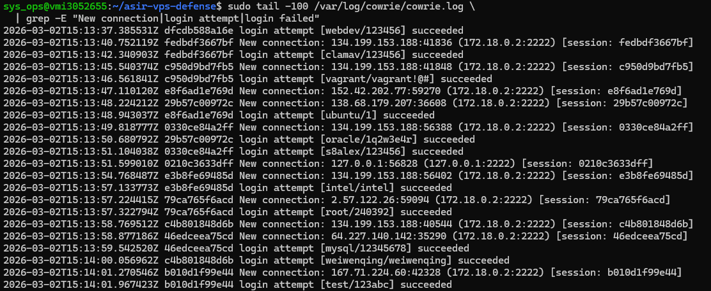
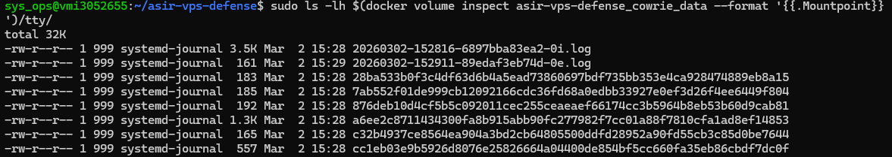
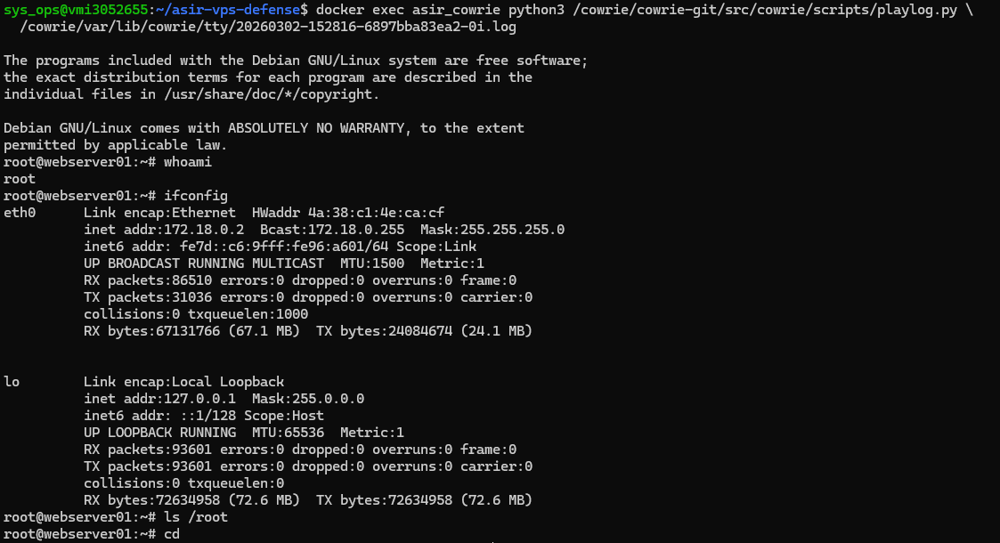

# 02 — Honeypot Cowrie

Este bloque documenta la capacidad de Cowrie para registrar conexiones, intentos de autenticación, sesiones interactivas y comandos ejecutados por los atacantes.

---

## EV-06 — `ev06_cowrie_log_ataques.png`

Se consultó el log principal de Cowrie. El volumen `/var/log/cowrie` está montado directamente en el host, por lo que el log es accesible sin necesidad de `docker exec` (la imagen de Cowrie es distroless y no dispone de herramientas de shell). Cowrie solo crea el archivo de log en el primer evento, por lo que es necesario haber generado tráfico previo contra el puerto 22. El log reflejó conexiones entrantes con IP de origen, puerto efímero, usuario y contraseña utilizados en cada intento, así como el resultado de la autenticación. Cowrie aceptó todas las credenciales conforme a la configuración del archivo `userdb.txt`.

```bash
# Generar tráfico previo (desde máquina externa):
ssh -o StrictHostKeyChecking=no root@<IP_VPS> -p 22

# Ver log en el host:
sudo tail -100 /var/log/cowrie/cowrie.log \
  | grep -E "New connection|login attempt|login failed"
```

---

## EV-07 — `ev07_cowrie_log_fragmento.txt`

Se extrajo un fragmento representativo del log de texto de Cowrie para su inclusión literal en la memoria técnica. Se seleccionaron líneas que cubren el ciclo completo: nueva conexión, intento de login y ejecución de comandos. El log es accesible directamente en el host a través del volumen montado.

- [ev07_cowrie_log_fragmento.txt](ev07_cowrie_log_fragmento.txt)

```bash
sudo grep -E "login attempt|New connection|Command found" \
  /var/log/cowrie/cowrie.log | tail -30
```

---

## EV-08 — `ev08_sesion_tty_lista.png`

Se listó el directorio de sesiones TTY para confirmar que Cowrie había grabado las sesiones interactivas de los atacantes. Cada archivo `.tty` corresponde a una sesión completa con timestamp de inicio. El volumen Docker `cowrie_data` almacena los datos de sesión; Docker Compose lo crea con prefijo del proyecto, por lo que el nombre real es `asir-vps-defense_cowrie_data`.

```bash
ls -lh $(docker volume inspect asir-vps-defense_cowrie_data --format '{{.Mountpoint}}')/tty/
```

---

## EV-09 — `ev09_sesion_tty_replay.png`

Se reprodujo una de las sesiones grabadas mediante la herramienta `playlog` incluida en Cowrie. La reproducción mostró en tiempo real los comandos ejecutados por el atacante dentro del entorno simulado, incluyendo reconocimiento del sistema y lectura de ficheros sensibles.

```bash
docker exec asir_cowrie python3 /cowrie/cowrie-git/src/cowrie/scripts/playlog.py \
  /cowrie/var/lib/cowrie/tty/<archivo>.log
```

---

## EV-10 — `ev10_hydra_result.txt`

Como prueba controlada, se lanzó un ataque de fuerza bruta con Hydra desde una máquina externa contra el puerto 22 del servidor. Hydra registró en su fichero de salida las credenciales con las que Cowrie concedió acceso, confirmando que el honeypot admitía cualquier combinación de usuario y contraseña sin restricción, a la vez que registraba cada intento en sus logs.

- [ev10_hydra_result.txt](ev10_hydra_result.txt)

```bash
hydra -l root -P /tmp/passwords.txt -t 4 -s 22 \
  -o /tmp/hydra_result.txt ssh://<IP_VPS>
```
