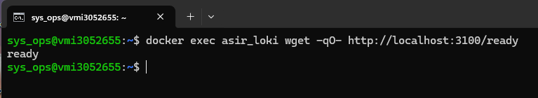
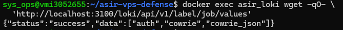
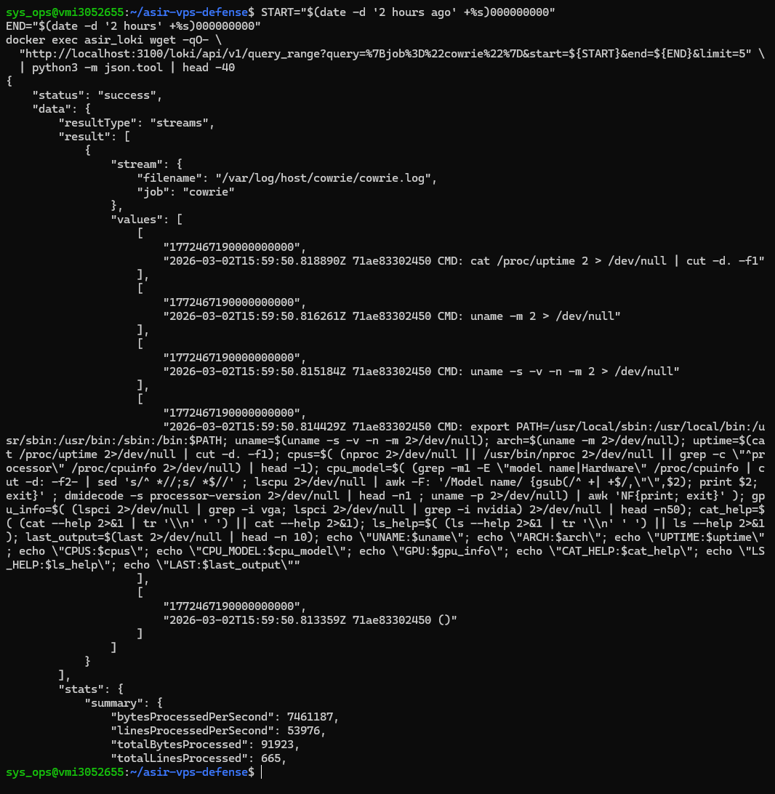
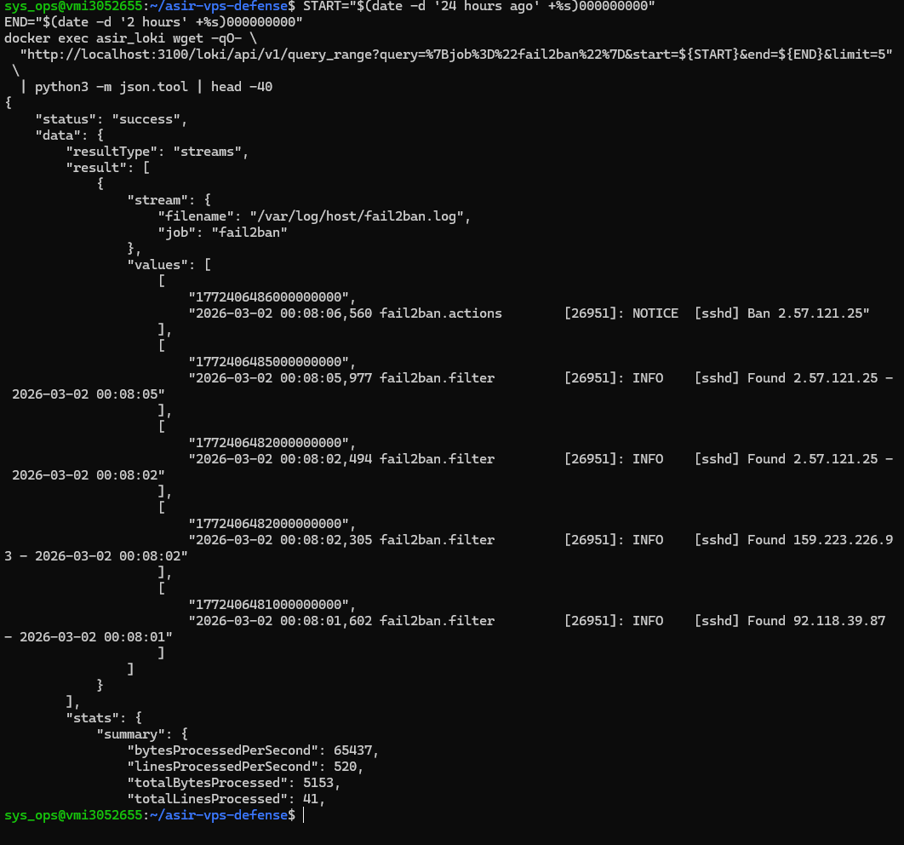

# 04 — Observabilidad (Loki + Promtail)

Este bloque verifica el funcionamiento del stack de observabilidad, comprobando que Promtail recopilaba activamente los logs del sistema y los enviaba a Loki, donde quedaban disponibles para consulta mediante LogQL.

---

## EV-14 — `ev14_loki_ready.png`

Se realizó una petición HTTP al endpoint `/ready` de Loki para verificar que el servicio había completado su inicialización y se encontraba en estado operativo. La respuesta `ready` confirmó que Loki estaba aceptando escrituras y sirviendo consultas. El puerto 3100 de Loki no está expuesto al host (red `backend_net` interna), por lo que la consulta se realiza desde dentro del propio contenedor mediante `docker exec`.

```bash
docker exec asir_loki wget -qO- http://localhost:3100/ready
```

---

## EV-15 — `ev15_promtail_targets.png`

Se consultó la API de etiquetas de Loki para verificar qué jobs estaba entregando Promtail. La imagen de Promtail es distroless y no dispone de herramientas de shell, por lo que la consulta se realizó a través del contenedor de Loki. La respuesta listó los jobs activos: `auth` (auth.log del host), `cowrie` y `cowrie_json` (honeypot). El job `fail2ban` aparecerá en cuanto Fail2Ban genere su primer ban y Promtail ingeste la entrada en Loki.

```bash
docker exec asir_loki wget -qO- \
  'http://localhost:3100/loki/api/v1/label/job/values'
```

---

## EV-16 — `ev16_loki_query_cowrie.png`

Se ejecutó una consulta LogQL contra la API de Loki para recuperar eventos del job `cowrie` dentro de la ventana temporal de las pruebas. La respuesta confirmó que los logs generados por el honeypot durante los ataques controlados habían llegado correctamente al sistema de centralización.

```bash
# El host VPS usa UTC; los logs de Cowrie tienen timestamp UTC+1.
# Se amplía la ventana temporal 2h hacia adelante para cubrir el offset horario.
START="$(date -d '2 hours ago' +%s)000000000"
END="$(date -d '2 hours' +%s)000000000"
docker exec asir_loki wget -qO- \
  "http://localhost:3100/loki/api/v1/query_range?query=%7Bjob%3D%22cowrie%22%7D&start=${START}&end=${END}&limit=5" \
  | python3 -m json.tool | head -40
```

---

## EV-17 — `ev17_loki_query_fail2ban.png`

De forma análoga, se consultó Loki para el job `fail2ban`. La respuesta incluyó las entradas de ban generadas durante las pruebas, confirmando el pipeline completo: Fail2Ban escribe en su log → Promtail detecta el cambio → Loki indexa la entrada → la consulta lo devuelve.

```bash
START="$(date -d '24 hours ago' +%s)000000000"
END="$(date -d '2 hours' +%s)000000000"
docker exec asir_loki wget -qO- \
  "http://localhost:3100/loki/api/v1/query_range?query=%7Bjob%3D%22fail2ban%22%7D&start=${START}&end=${END}&limit=5" \
  | python3 -m json.tool | head -40
```
