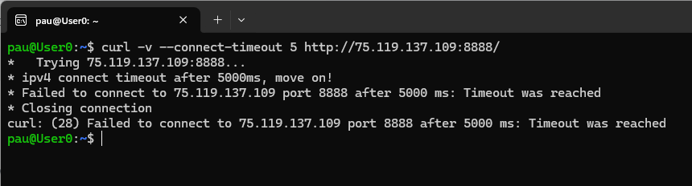
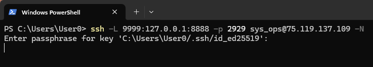
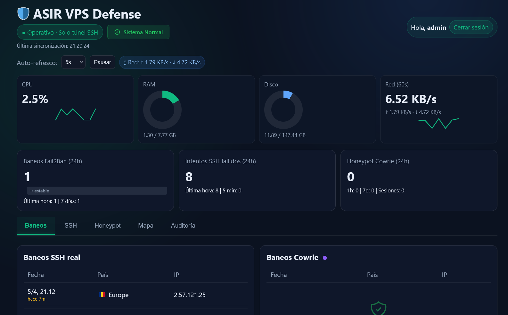
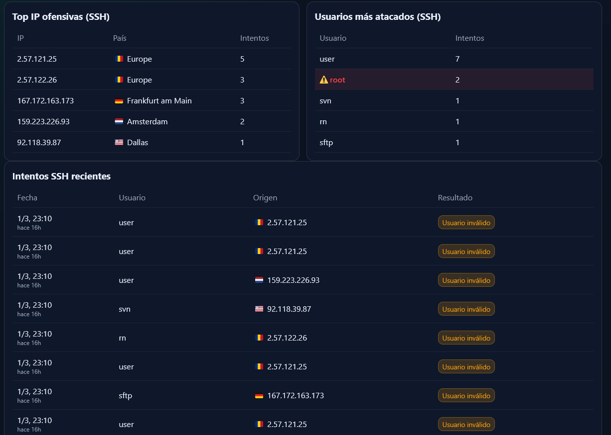
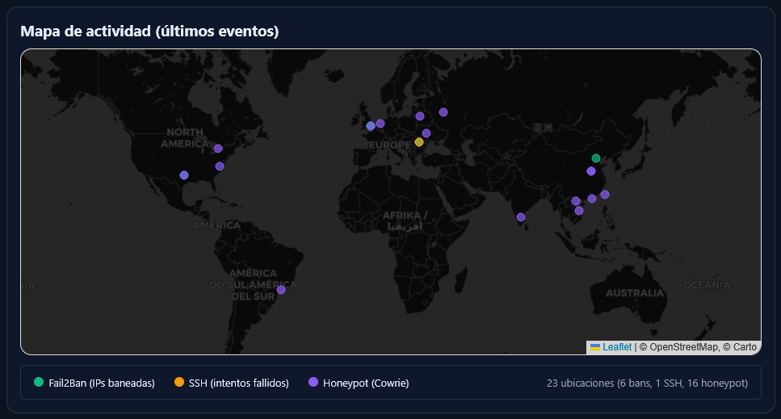
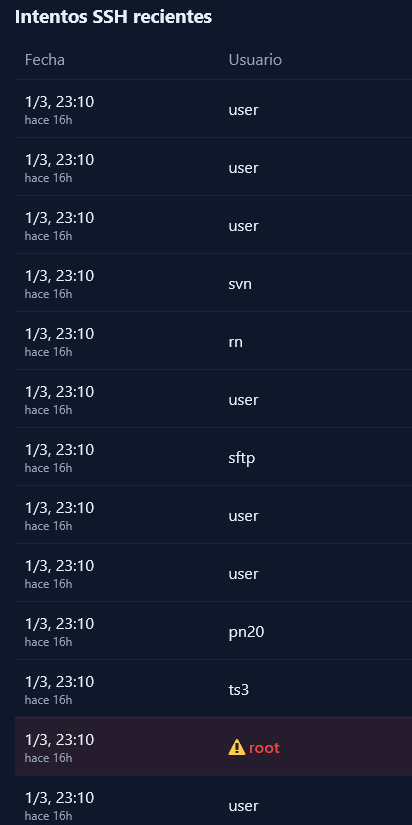

# 05 — Panel privado (acceso por túnel SSH)

Este bloque documenta el mecanismo de acceso restringido al panel de administración, que expone métricas del honeypot exclusivamente a través de un túnel SSH local, sin ninguna exposición pública directa.

---

## EV-18 — `ev18_panel_bloqueado_ext.png`

Se intentó acceder al puerto 8888 del servidor directamente desde una máquina externa para verificar que no existía exposición pública del panel. La conexión fue rechazada, conforme a la configuración del `docker-compose.yml` que vincula el contenedor `admin-nginx` exclusivamente a `127.0.0.1:8888`.

```bash
curl -v --connect-timeout 5 http://<IP_VPS>:8888/
```

---

## EV-19 — `ev19_tunel_ssh_activo.png`

Para acceder al panel, se estableció un túnel SSH desde la máquina de administración hacia el servidor. El túnel redirigía el puerto local 9999 al puerto 8888 de loopback del servidor, canalizando el tráfico a través de la sesión SSH autenticada con clave pública.

```bash
ssh -L 9999:127.0.0.1:8888 -p 2929 adminuser@<IP_VPS> -N
```

---

## EV-20 — `ev20_panel_dashboard.png`

Con el túnel activo, se accedió al panel mediante el navegador en `http://localhost:9999`. El dashboard presentó los contadores de actividad del honeypot actualizados con los datos generados durante las pruebas controladas realizadas previamente. La barra de dirección visible en la captura acredita que el acceso se realizó a través del túnel SSH local y no mediante exposición directa del servicio a Internet.

---

## EV-21 — `ev21_panel_tabla_ataques.png`

Se capturó la sección de listado detallado del panel, que mostraba cada intento de conexión registrado por Cowrie con sus metadatos completos: IP de origen, usuario empleado, contraseña utilizada, timestamp y geolocalización del atacante.

---

## EV-22 — `ev22_panel_mapa_geo.png`

El panel incorpora un mapa de geolocalización que sitúa geográficamente las IPs atacantes utilizando la base de datos GeoLite2-City de MaxMind. La captura muestra la distribución geográfica real de los ataques recibidos durante el período de actividad del honeypot.


---

## EV-23 — `ev23_panel_grafica_tiempo.png`

Se capturó la gráfica de actividad temporal del panel, que refleja la distribución de intentos de conexión a lo largo del tiempo.



---
