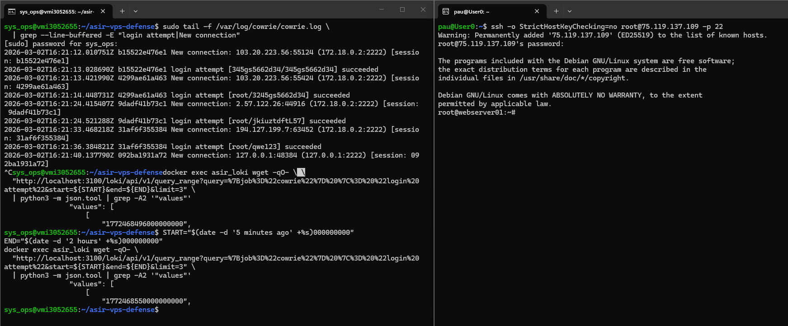
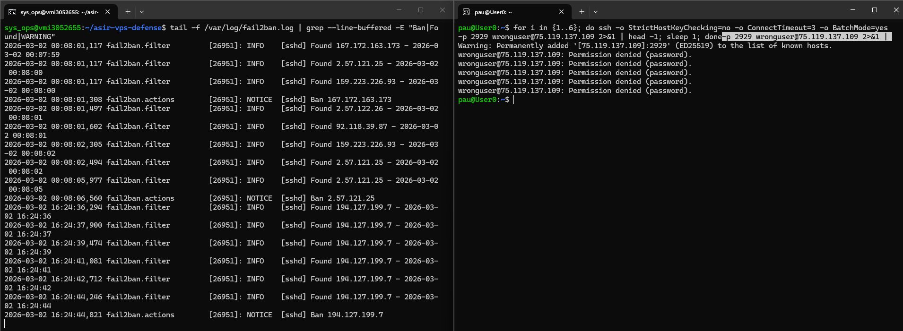

# 07 — Pipeline completo

Este bloque documenta la validación del ciclo completo del sistema, desde la recepción de un ataque hasta su visualización en el panel, pasando por el registro en logs, la centralización en Loki y, en el caso de Fail2Ban, la aplicación del bloqueo. Se trata de la evidencia de mayor valor técnico del proyecto.

---

## EV-28 — `ev28_pipeline_ataque.png`

Se validó el pipeline de observabilidad del honeypot de forma integral. Se abrieron tres terminales simultáneas: la primera ejecutaba un `tail -f` del log de Cowrie en el servidor; desde la segunda se realizó una conexión al honeypot simulando el comportamiento de un atacante; la tercera lanzó, tras un intervalo de 35 segundos suficiente para que Promtail procesara el nuevo contenido del log, una consulta LogQL a Loki que devolvió el evento registrado. La captura muestra las tres ventanas de forma simultánea, acreditando la causalidad entre el ataque y su registro en el sistema de observabilidad.

```bash
# Terminal 1 — seguimiento en tiempo real del log Cowrie (bind mount en el host):
sudo tail -f /var/log/cowrie/cowrie.log \
  | grep --line-buffered -E "login attempt|New connection"

# Terminal 2 — conexión al honeypot (desde máquina externa):
ssh -o StrictHostKeyChecking=no root@<IP_VPS> -p 22

# Terminal 3 — consulta Loki tras el ataque (~35s después para que Promtail procese):
START="$(date -d '5 minutes ago' +%s)000000000"
END="$(date -d '2 hours' +%s)000000000"
docker exec asir_loki wget -qO- \
  "http://localhost:3100/loki/api/v1/query_range?query=%7Bjob%3D%22cowrie%22%7D%20%7C%3D%20%22login%20attempt%22&start=${START}&end=${END}&limit=3" \
  | python3 -m json.tool | grep -A2 '"values"'
```

---

## EV-29 — `ev29_pipeline_ban.png`

De forma análoga, se validó el pipeline de Fail2Ban. La primera terminal seguía el log de Fail2Ban en tiempo real; desde la segunda se ejecutaron múltiples intentos de autenticación fallidos contra el puerto SSH real; la tercera mostraba en bucle el estado de la jail `sshd` mediante `watch`. La captura recoge el momento en que, tras superar el umbral de intentos configurado, Fail2Ban aplicó la regla de ban y la IP quedó bloqueada, cerrando el ciclo detección-respuesta.

```bash
# Terminal 1 — seguimiento del log Fail2Ban:
tail -f /var/log/fail2ban.log | grep --line-buffered -E "Ban|Found|WARNING"

# Terminal 2 — intentos fallidos desde IP externa (BatchMode evita prompt):
for i in {1..6}; do ssh -o StrictHostKeyChecking=no -o ConnectTimeout=3 -o BatchMode=yes -p 2929 wronguser@<IP_VPS> 2>&1 | head -1; sleep 1; done
```


Es la evidencia de mayor valor técnico para la memoria.
